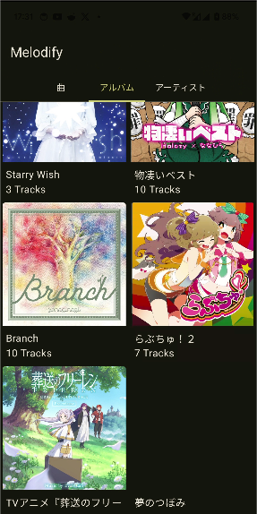

> A unidirectional data flow (UDF) is a design pattern where state flows down and events flow up. By following unidirectional data flow, you can decouple composables that display state in the UI from the parts of your app that store and change state.

#### UDF设计模式解决了什么问题？

开发App需要考虑的问题无非是处理事件， 然后更新UI。 听起来简单， 但是实际情况要复杂的多， 
事件可能是用户操作， 也有可能是系统或外部的事件。 UI的数据来源有可能是数据库， 也有可能是网络。
这就导致App的状态更新不及时， 导致Bug的发生。

UDF的设计模式可以简化这个流程， 将改变状态和更新UI解偶。

#### 举例
考虑一个场景， 我有一个音乐播放器App， 他的数据来源是手机本地的音乐文件。
用户可以删除音乐文件, 删除文件后， 需要更新App的UI状态。

这个App有两个页面， 第一个是显示所有专辑的页面， 另一个是专辑列表页面。

